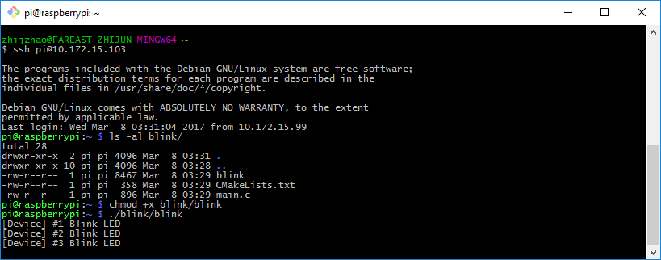
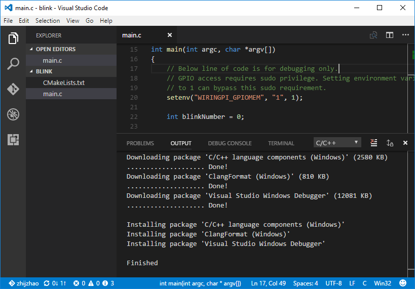
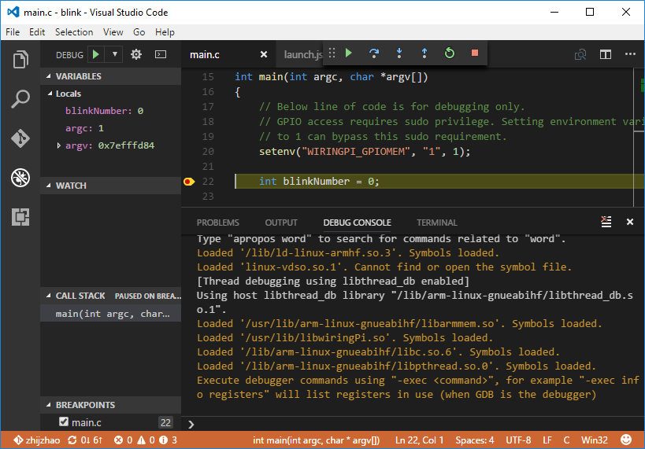

## Configure your device

Go to [Configure your device](https://docs.microsoft.com/en-us/azure/iot-hub/iot-hub-raspberry-pi-kit-c-lesson1-configure-your-device) page and setup your Pi for first-time use.

## Get the tools

### Install Git

Click below link to download and install Git for Windows.

* [Get Git for Windows](https://git-scm.com/download/win/)

### Install Docker
Go to [Docker website](https://www.docker.com/). Scroll down and find the `Get Docker for Windows` link. Click it for download and installation.

## Build C code using Docker

1. Run below command to clone the repo.

   ```bash
   git clone https://github.com/Azure-Samples/iot-hub-c-raspberrypi-docker.git
   ```

2. Run below commands to do the build. 

   ```bash
   docker pull zhijzhao/raspberrypi
   ```

   > Below `<>` part needs to be replaced with your own value.

   ```bash
   docker run --rm -v <d:\some-path\iot-hub-c-raspberrypi-docker\samples>:/repo -it zhijzhao/raspberrypi /build.sh --source blink
   ```

   * `--rm` is a Docker running option. For details, please check [Docker reference](https://docs.docker.com/engine/reference/commandline/run/).
   * `<d:\some-path\iot-hub-c-raspberrypi-docker\samples>` is the full path of sample folder. Replace it with the path on your host machine.
   * `-v` option maps your sample folder to `/repo` folder of the Ubuntu OS running inside Docker container.
   * `-it` option allows you to interact with the running Docker container.
   * `zhijzhao/raspberrypi` is Docker image name. Reference `dockerfile` folder if you're interested in how it works.
   * `/build.sh` is the shell script name inside the Ubuntu container. `--source blink` tells `build.sh` that `CMakeList.txt` is under `blink` folder.

   

## Deploy and run the built app
1. Open `Git Bash` program. 

2. Use SCP to deploy the built binary and sample code to your Pi's `/home/pi` folder.

  > Below `<>` parts need to be replaced with your own values.

   ```bash
   cd </d/iot-hub-c-raspberrypi-docker/samples>
   scp -r blink <user name>@<device ip address>:/home/pi
   scp build/blink/blink <user name>@<device ip address>:/home/pi/blink
   ```
   

3. Use SSH to login in to the Pi device. Then add executable permission to the built app. Finally, run the app.

   ```bash
   ssh <user name>@<device ip address>
   chmod +x blink/blink
   sudo blink/blink
   ```

   

## Debug the app

1. Install Visual Studio Code

   * [Download](https://code.visualstudio.com/docs/setup/windows) and install Visual Studio Code. Visual Studio Code is a lightweight but powerful source code editor.

   * Open VS Code and install extension named `C/C++`. If you have already installed it, please make sure you're using the latest version.

      a. Type `code` command in your console.
      
      b. In VS Code, press `Ctrl + P` and type `ext install c/c++` as below.

      
      
      c. Click `Install` to install the extension and reload VS Code as prompted. 

      


2. The `C/C++` extension needs a pipe program to communicate with a remote shell for remote debugging. Here we choose SSH. To avoid password input, we generate SSH key and upload it to Pi. 

   a. Run `ssh-keygen` command in `Git Bash` to generate SSH key.
   
   

   b. Run `ssh-copy-id <user name>@<device IP address>` to upload the SSH key to device.

   

   c. Run below command to open the `blink` folder.

   ```bash
   code iot-hub-c-raspberrypi-docker\samples\blink
   ```

   

4. Generate `lanuch.json`.

   * Press `F5` key. VS Code will prompt for environment selection.

   

   * Choose `C++(GDB/LLDB)`. `launch.json` is generated automatically.

   

5. Config `launch.json`.

   * `program` is the full path of the deployed app on device. The built binary is at `./build/app` and by default it's deployed to device's `/home/pi` folder. So the full path value should be `/home/pi/build/app`.
 
   * `cwd` is the working folder on device and should be `/home/pi/blink`.

   * `pipeTransport` is for authenticating pipe connection. Paste below properties to `launch.json` and update the user name and IP address accordingly.

      ```
      "pipeTransport": {
        "pipeCwd": "C:\\Program Files\\Git\\usr\\bin",
        "pipeProgram": "C:\\Program Files\\Git\\usr\\bin\\ssh.exe",
        "pipeArgs": [
          "<user name>@<device ip address>"
        ],
        "debuggerPath": "/usr/bin/gdb"
      },
      ``` 

   * `sourceFileMap` is for mapping the path of where the code exists on the remote shell to where it is locally. Please add this property and update these two paths accordingly.

      ```
      "sourceFileMap": {
            // "remote": "local"
            "/home/pi/blink": "<d:\\some-path\\iot-hub-c-raspberrypi-docker\\samples\\blink>"
      },
      ```

   

6. Debug `main.c`.

   a. Open `main.c` and insert breakpoints by pressing `F9` key.

   b. Start debugging by pressing `F5` key. Code execution will stop at the breakpoint you set.
   
   c. Press `F10` to debug step by step. Enjoy debugging!

   

## Send message to Azure IoT hub

The `zhijzhao/raspberrypi` docker image also includes Azure IoT C SDK. If you're interested in how to send messages to IoT Hub, the source code is under `azure-iot-hub` folder. Simply replace the `blink` folder name with `azure-iot-hub` and all the above steps/commands still work.

## Contributing
This project has adopted the [Microsoft Open Source Code of Conduct](https://opensource.microsoft.com/codeofconduct/). For more information see the [Code of Conduct FAQ](https://opensource.microsoft.com/codeofconduct/faq/) or contact [opencode@microsoft.com](mailto:opencode@microsoft.com) with any additional questions or comments.
